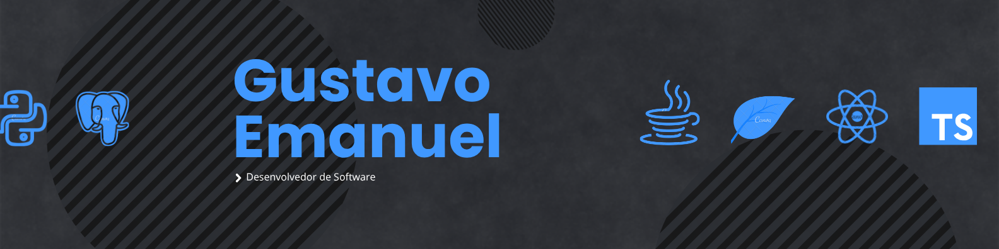

**Hi, I'm Gustavo! **

* * *

## 📝 Sobre mim:

- 💻 Eu sou desenvolvedor web full-stack
- ⚛️ SpringBoot | React | Python
- 🎓 Graduando em Análise e Desenvolvimento de Sistemas
- 🧠 Apaixonado por aprender, resolver problemas e construir produtos escaláveis
- 🤝 Aberto a colaborações e novos desafios em projetos web ou back-end
 

##  Linguagens e ferramentas:

  

  

  

 

## 📊 Status do Github

  

 

## 📫 Conecte-se comigo

   

  
 

  
  

